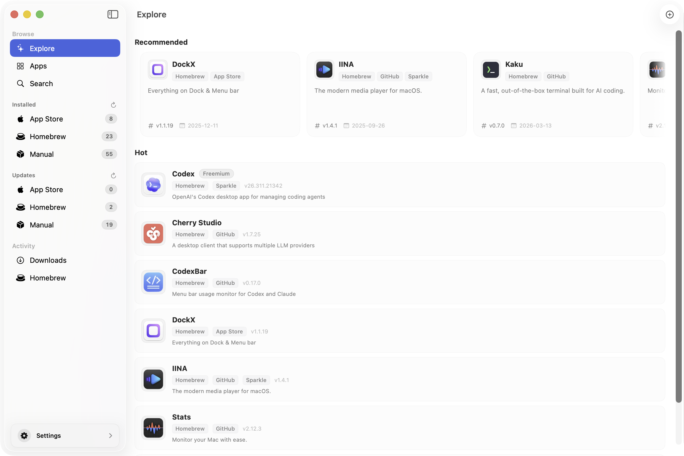

# AppFresh


## Keep your apps fresh

Discover and track updates for Mac apps outside the App Store.

[](https://github.com/AppFresh/AppFresh/stargazers)
[](https://github.com/AppFresh/AppFresh/releases)
[](LICENSE)
[](https://AppFresh.app)

## ✨ What is AppFresh

**AppFresh** helps you discover and keep **Mac apps outside the App Store** up to date.

Many great macOS tools are distributed independently — through developer websites, GitHub, or direct downloads.

- discover great Mac apps
- track updates
- manage installed apps
- keep everything up to date

## 🖥 Screenshot



## 🚀 Features

### 🔎 Discover Mac Apps
Explore awesome apps outside the App Store.

Find useful indie tools, open-source utilities, and developer apps.

### 📡 Track Updates
AppFresh monitors installed apps and notifies you when updates are available.

Never miss a new release again.

### ⚡ Update Easily
Install the latest version of apps quickly.

Keep your Mac software up to date with minimal effort.

### 🧭 Manage Installed Apps
See all apps installed outside the App Store in one place.

Organize and manage your Mac app library.


## 🤔 Why AppFresh

macOS has many great apps that are **not distributed through the App Store**.

Examples include tools similar to:

- IINA
- Rectangle
- Raycast

Keeping them updated can be difficult.

**AppFresh solves this problem.**


## ⚙️ Installation

### Download

Download the latest release:

```
https://github.com/AppFresh/AppFresh/releases
```

Or visit:

```
https://AppFresh.app
```

### Install with Homebrew

```bash
brew install --cask AppFresh
```


## 🖥 Requirements

- macOS 13+
- Apple Silicon or Intel


## ⭐ Support the Project

If you find **AppFresh** useful:

⭐ **Give the project a star**

It helps more developers discover the project.


## 🔗 Links

Website: https://AppFresh.app  
Releases: https://github.com/AppFresh/AppFresh/releases
